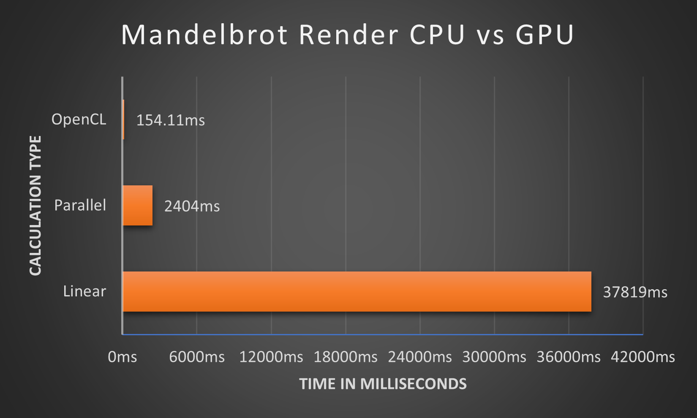
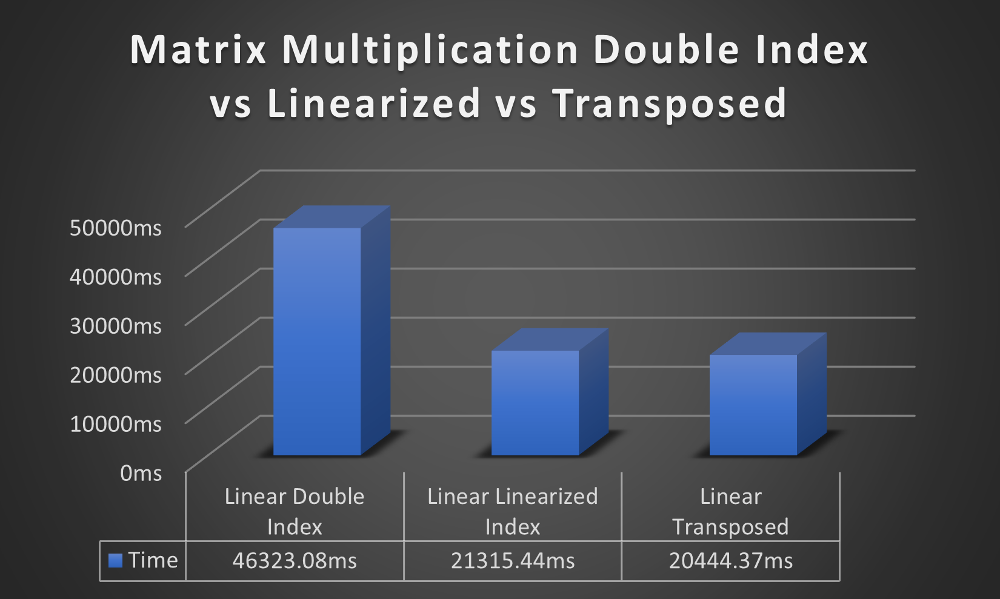
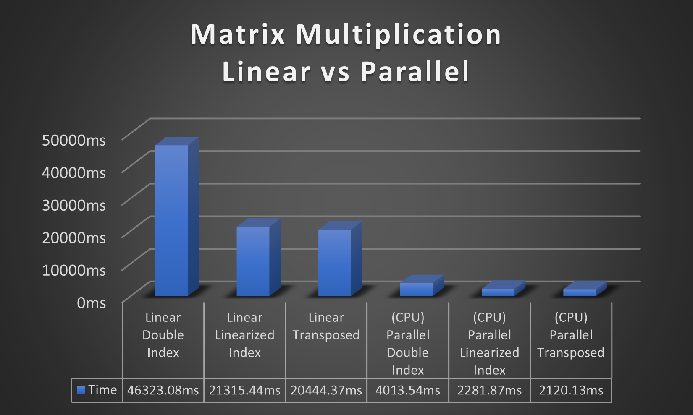
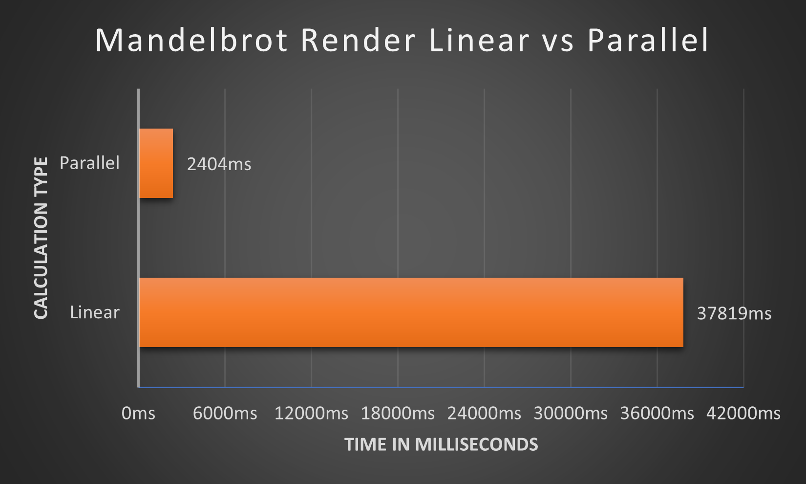
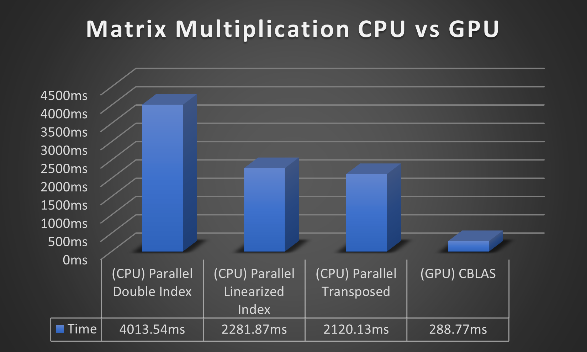

# MandelbrotCL_TCPT3

(TCP assignment) WinForms program that allows for the calculation of the
Mandelbrot set in multiple ways with a focus on OpenCL.

## Author

- Leandro Brás a22100770

## Summary

This project was created as the third assignment for the class of
`Parallel Computing Techniques` with the objective of implementing the
Mandelbrot Set in OpenCL, with a focus on efficient rendering and the ability
to display statistics about the rendering process.

I chose to use `WinForms` as an easy way to make the `Mandelbrot` in `OpenCL`
interactive, allowing the user to zoom in/out and move around. It also allowed
for a more interactive and visually pleasing UI.

The user has the option of running a `CPU` or `GPU` based `Mandelbrot`
calculator to determine the advantages of parallel computing when calculating
the fractal set, or as a bonus the user can also run an interactive view of the
`Mandelbrot Set` in `OpenGL` and `OpenCL` where it's possible to zoom in/out and
change the number of iterations dynamically.

Additionally there's a bonus form where the user can do a quick comparison
between the `CPU` and `GPU` on `Matrix multiplication`. This using parallel `CPU`
computing for the `CPU` part of the comparison and `CBLAS` for the `GPU` part of
the comparison.

## Instructions

**Note:** This project can only be used on `Windows`.

### Menu Options

- OpenCL:
  - Switch to the OpenCL tab for an interactive view of the Mandelbrot Set being
  rendered using `OpenCL.NET`, allowing the user to zoom in/out and move around.
- OpenGL:
  - Opens a new `OpenGL` window that displays the `Mandelbrot Set` at interactive
rates and allows the user to move around, zoom and change the number of
iterations.
- Bench Mark:
  - Switch to the Bench Mark tab, this tab allows the user to do a single render
  of the `Mandelbrot Set` in a `Linear`, `Parallel` or `OpenC`L way. It also
  contains a bench button that runs a benchmark rendering the set 3 times for
  each of the render types displaying the average results at the end.
- Stats:
  - Shows the averaged results of all calculations done so far and a list with
  every single calculation done so far.
- Bonus:
  - Opens a new Bonus Form that allows the user to run a mini benchmark
  comparing the time it takes to multiply 2 4092x4092 matrixes between the `CPU`
  and `CBLAS`.

### OpenGL/CL Mandelbrot Controlls

- **Click** anywhere on the screen with `Middle Mouse Button` and **drag** the
`Mouse` to **move** around;
- Use the `Mouse Wheel` to **zoom in / out** on the `Mouse`'s current position;
- **Hold** `Shift + Mouse Wheel` to **increase/decrease** the number of
**iterations** **(OpenCL is fixed to 1000iter)**;

## Architecture

### Overview

This is a relatively big project but the main focus is the `OpenCLMandelbrot`
class which is responsible for handling the OpenCL implementation of the
Mandelbrot set visualization which was the focus of this project. It includes
several properties and methods for initializing and executing the computation on
a GPU. The `Init()` method is used to setup OpenCL and compile the code, it
detects available video cards, creates a context for the chosen GPU, initializes
the command queue, reads the program source from a file, creates a program and
builds it.

```csharp
// Detect video cards
platforms = Cl.GetPlatformIDs(out errorCode);
foreach (Platform platform in platforms) {
    foreach (Device device in Cl.GetDeviceIDs(platform, DeviceType.Gpu, out errorCode)) {
        devices.Add(device);
    }
}
// Chose the GPU
gpu = devices[gpuNum];
```

```csharp
// Create context
context = Cl.CreateContext(null, 1, new Device[] { gpu }, null, IntPtr.Zero, out errorCode);
// Initialize the command list
commandQueue = Cl.CreateCommandQueue(context, gpu, CommandQueueProperties.OutOfOrderExecModeEnable, out errorCode);
// Read program
string programSource = string.Join(System.Environment.NewLine, File.ReadLines(kernelPath));
// Create program
program = Cl.CreateProgramWithSource(context, 1, new string[] { programSource }, null, out err);
errorCode = Cl.BuildProgram(program, 0, null, compileOption, null, IntPtr.Zero);
```

The `ComputeGPU()` method is used to start the computation, it takes several
parameters such as the image buffer, the number of columns and rows of the
image, and the X and Y center values for the image. This method creates and sets
the kernel, sets the arguments for the kernel, and executes the kernel.

```csharp
// Allocating a buffer example
aspectMem = (Mem)Cl.CreateBuffer(context, MemFlags.ReadOnly, sizeof(double), out err);

// Copy the host buffer to the input device buffer example
Cl.EnqueueWriteBuffer(commandQueue, (IMem)aspectMem, Bool.True, IntPtr.Zero, 
    new IntPtr(sizeof(double)), windowAspect, 0, null, out event0);

// Setting kernel argument and enqueue for execution
Cl.SetKernelArg(kernel, 0, (IntPtr)intPtrSize, aspectMem);
```

To handle memory allocation and data transfer, the class includes methods such
as `EnqueueWriteBuffer()`, `SetKernelArg()`, and `EnqueueReadBuffer()`. These
methods are used for allocating memory on the device, copying data from host to
device, and copying data from device to host.

```csharp
// Use the maximum number of work items supported for this kernel on this device
local = new InfoBuffer(new IntPtr(4));
Cl.GetKernelWorkGroupInfo(kernel, gpu, KernelWorkGroupInfo.WorkGroupSize, 
    new IntPtr(sizeof(int)), local, out notUsed);

// Setting the workGroupSize
workGroupSizePtr = new IntPtr[] { (IntPtr)countX, (IntPtr)countY};
Cl.EnqueueNDRangeKernel(commandQueue, kernel, 2, null, workGroupSizePtr, null, 0, null, out event0);

// Launch the calculations in the queue
Cl.Finish(commandQueue);

// Direct copy to the image buffer
Cl.EnqueueReadBuffer(commandQueue, (IMem)outputMem, Bool.True, IntPtr.Zero, 
    new IntPtr(countX * countY * sizeof(uint)), ptr, 0, null, out event0);
```

The `ReComputeGPU()` method is used to recalculate the Mandelbrot set with new
parameters it should be used when the user changes the parameters of the
visualization such as the center point, the scale, or the number of iterations,
and wants to update the visualization without re-initializing all OpenCL data
and resources, saving resources and time.

Lastly the `ClearClData()` method is used to release the memory allocated for
OpenCL buffers, this is done using the `ReleaseMemObject()` and
`ReleaseKernel()` methods.

```csharp
Cl.ReleaseMemObject((IMem)aspectMem);
Cl.ReleaseKernel(kernel);
```

In summary, the `OpenCLMandelbrot` class is the OpenCL component of the project
and it demonstrates how to use OpenCL to perform a computation on a GPU for
visualizing the Mandelbrot set. It uses OpenCL to create a context, command
queue, program, and kernel, and uses methods such as `CreateBuffer`,
`SetKernelArg`, `EnqueueNDRangeKernel`, `ClearClData`, and `ReComputeGPU`, to
set up, execute and maintain the computation, and also release the resources
used by OpenCL once they are no longer needed.

## Results

**Note:** For the best results run the project in `Release` mode.

The tests where done on my own computer with the following specs:

- MSI RTX 4090 Gaming X Trio
- Ryzen 9 5900X (12core 24thread)
- 32Gb (4x8Gb) 3600Mhz Cl16

These results where obtain by running the benchmark option with a resolution of
4096x4096 and 1000 iterations.

*(Note that these results will be different depending on the CPU
and the total number of cores)*.

### Average Time Table

In Milliseconds:

|    Linear    |   Parallel   |    OpenCL    |
| :----------: | :----------: | :----------: |
|  37819.00ms  |  2404.00ms   |   154.11ms   |

Times Faster Compared to Linear:
|   Parallel   |    OpenCL    |
| :----------: | :----------: |
|    15.73x    |    245.4x    |

Graph Comparison:



From these results we can see two massive leaps in performance, from Linear to
Parallel and Parallel to OpenCL. With Parallel being `15.73` times faster than
Linear and OpenCL being `15.60` times faster than `Parallel` and a whopping
`245.40` times faster that Linear CPU calculations. Of curse lets not forget
that CPUs and GPU function in a very different ways.

## Looking Back

Throughout this Parallel Computing class, we have learned several techniques for
parallel programming. Some of these techniques include using `Linearized Index`
matrices, matrix `Transposition`, multiple `Threads`, and using `OpenCL` and 
`OpenBlas` for calculations on the GPU.

We started with `Linearized Index Matrices` and `Matrix Transposition` these are
techniques used to improve the performance of matrix operations on `CPUs`. By
linearizing the index of a matrix, we can take advantage of the cache locality
of CPUs to improve performance. `Transposing` a matrix can also further improve
performance by improving cache locality and reducing the number of cache misses.
These techniques are extremely useful for improving the performance of matrix
operations on CPUs but they may not have a significant impact on GPU
computations.

<div style="text-align:center">
    
</div>

Using multiple `Threads` is a technique for parallel programming that allows
different parts of a program to be executed simultaneously. This can be done
using the `Thread` class, `Tasks` or `Parallel.For()` in `C#`. This technique
can be very useful for breaking down large computations into smaller tasks that
can be executed simultaneous. However, it also requires careful management of
shared `resources` and `synchronization` to avoid issues with the data that's being
handled.

<div style="text-align:center">
    
    
</div>

Using `OpenCL` and `OpenBlas` are techniques for parallel programming that allow
for computations to be performed on the `GPU`. `OpenCL` is a framework for
writing programs that can execute on a wide range of devices, including `CPUs`,
`GPUs`, and other specialized processors. `OpenBlas` is a library that
specializes in linear algebra, and it is optimized for use on a variety of
architectures, including `CPUs` and `GPUs`. These techniques can greatly improve
the performance of computations (As seen on this project) by offloading them to
the `GPU`, which has a large number of cores and specialized hardware for
performing mathematical operations. However, they also require a significant
amount of work to set up and manage, and may have a steeper learning curve than
other techniques.

<div style="text-align:center">
    
    
</div>

Outside of class "bounds" I also implemented a program that uses `OpenGL` to
interactively render the `Mandelbrot Set`. `OpenGL` is a cross-platform,
graphics `API` that is widely used for creating interactive applications. It
provides a powerful and flexible way to create and manipulate `2D` and `3D`
graphics. `OpenGL` allows us to write code that runs on the GPU, taking
advantage of its parallel processing capabilities to perform complex graphics
operations quickly and efficiently and unlike `OpenCL`, `OpenGL` is designed to
run in realtime.

## Conclusion

In conclusion I think this project is a great example of how `OpenCL` can be
used to perform complex computations on a `GPU`, in this case, the
`Mandelbrot Set` visualization. It demonstrates how to use `OpenCL` to create a
context, command queue, program, and kernel, and uses methods such as
`CreateBuffer`, `SetKernelArg`, `EnqueueNDRangeKernel` to execute the
computation. The project also showcases other parallel computing techniques such
as using multiple threads, or things like using linearized index matrices, and
using `OpenBlas` for doing calculations on the GPU on the Bonus section.

In this project, I had the opportunity to work with various parallel computing
techniques. However, without the guidance and support of my Professor José
Rogado, it would have been much more difficult to understand the intricacies of
parallel computing and implement them effectively in this project.

I am grateful for the knowledge and experience that I gained while working on
this project and attending the classes, and I am especially grateful to my
Professor for his support and guidance throughout the process.

In summary, I would like to express my sincere gratitude to my Professor José
Rogado for his invaluable contributions to this project, for his availability to
help his students and for providing me with the knowledge and skills needed to
create this program. I am confident that the experience and knowledge I gained
from this project will be useful in my future endeavors.
